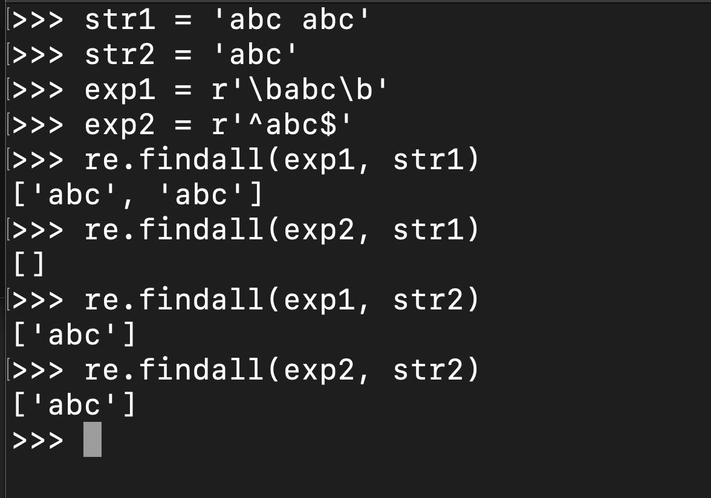

## Regular Expression

This is an ongoing article. I will be able to finish it in a couple of days.

I always want to post something else in this website instead of just leetcode solutions. And the other day, my friend asked me something about regular expression. And I decided to write a artical about regular expression. And this is it.

#### 1. Introduction

In fact we use regular expression all the time, like when we use Ctrl+F to search some content in the webpage, the string we typed is actually a regular expression. 

For example, we want to search the word **"exp"**, and we type exp, the exp is an regular expression, however, the would give us some result that we don't want, like the "exp" in these words: "experience", "expression", "expect". Now, what if we only want the word "exp"? This is when the real regular expression come in.

In general, we think regular expression is just an expression that used to determine whether a string fits our requirement or not.

I am going to list the regular expression for word **"exp"** here:  `\bexp\b`. And we will talk about it later.

#### 2. Metacharacters

Metacharacters are some characters that have a special meaning to a computer program. For example, the `\b` in the previous example is a metacharacters. It means before an word or the end of the word. The first `\b` means before the start of the word, and exp means after the start, there are 3 chars, 'e', 'x', and 'p', and the second `\b` means after the end of the word. In a more general speaking: there is an exp between the start and the end of the word, which means the word is exactly "exp".

Now, lets talk about some other metacharacters.

| Metacharacter | Meaning                                                  |
| ------------- | -------------------------------------------------------- |
| ^             | The begining of the word                                 |
| $             | The end of the word                                      |
| .             | The period matches any alphanumeric character or symbol. |
| \d            | Whole Number 0 - 9                                       |
| \w            | Alphanumeric Character                                   |
| \s            | anylength of space                                       |

You might wonder what is the difference between `^$` and `\b`.  Well, you can understant it this way, `^$` is used to validate the whole in put string, it doen's care how many spaces, how many words are in the string, it treats them all as a string, and this string must start and end with the designated char. But `\b` is more like find each word in the string, and return all that matches. The below image will help you understand that.

Now let's look at some metacharacters that related to numbe of apppearance of some char.

| Metacharacter related to number of appearance | Meaning                                      |
| --------------------------------------------- | -------------------------------------------- |
| +                                             | Repeat 1 or more than once                   |
| *                                             | Repeat 0 or more time                        |
| {a}                                           | Repeat exact a times                         |
| {a, }                                         | Repeat at least a times                      |
| {a, b}                                        | Repeat at least a times, and at most b times |

Here are some examples:

| Regular Expression | Meaning                                                      | Example |
| ------------------ | ------------------------------------------------------------ | ----- |
| a\d+               | There are more than one number following char 'a'            |a12345|
| GPA\w{3}      | The string start with 'GPA' and followed by 3 Alphanumeric Character |GPA400|
| GPA\d{1,3} | The string start with 'GPA' and followed by 1/2/3 numbers |GPA2|

#### 3. Enumerate

Sometimes, we might encounter the situation that we only want the string contains some specific char, in this situation we will need to enumerate the value of our desired chars. 

We use `[]`to denote to char we want. Example `[abc]`, means we only want to match char 'a', 'b', 'c'. `[!?]` use to match Punctuation Marks. 

There are some frequently used enumerations: `[a-zA-Z]` matches any lower or upper letter. `[a-zA-Z0-9_]` is the same as `\w`. 

#### 4. Branch

We use `|` to denote branch. This symble here is equal to or condition. `exp1|exp2` means if exp1 or exp2 matches the input, we should return True.

For example, if we want to match a US phone number. The phone number usually has two format: a ten digit number of (abc)-def-ghij. In this case, our regular expression can be written as `\d{10}|\(\d{3}\)-\d{3}-d{4}` 

#### 5. Grouping

From above we know we can use `{}` to set the number a char appears that we want, but want if we want the string 'abc' to appear 3 times? That we can use `()` to to that: `(abc){3}`

#### 6. Exclusion

Sometime we want to match a string without some specific char, this is the time when exlusion kicks in.

Still remember the metacharacters we talked about above? Did you notice that they are all in the lower case. Now, if we turn them in **UPPER CASE**, their meaning would be except xxx.

| Metacharacter | Meaning                        |
| ------------- | ------------------------------ |
| \D            | exclude any number             |
| \W            | exclude Alphanumeric Character |
| \S            | except space                   |
| \B            | Except the start of the word   |
| [^abc]        | Exclude char 'a', 'b', 'c'     |

## Some Exercise

#### 1. Match IP address

`((2[0-4]\d|25[0-5]|[01]?\d\d?)\.){3}(2[0-4]\d|25[0-5]|[01]?\d\d?)`

#### 2. A string only contains 'a' and 'b', and the string needs to start and end with the same char.

`\ba[ab]*a\b|\bb[ab]*b\b|\ba{1}\b|\bb{1}\b`

